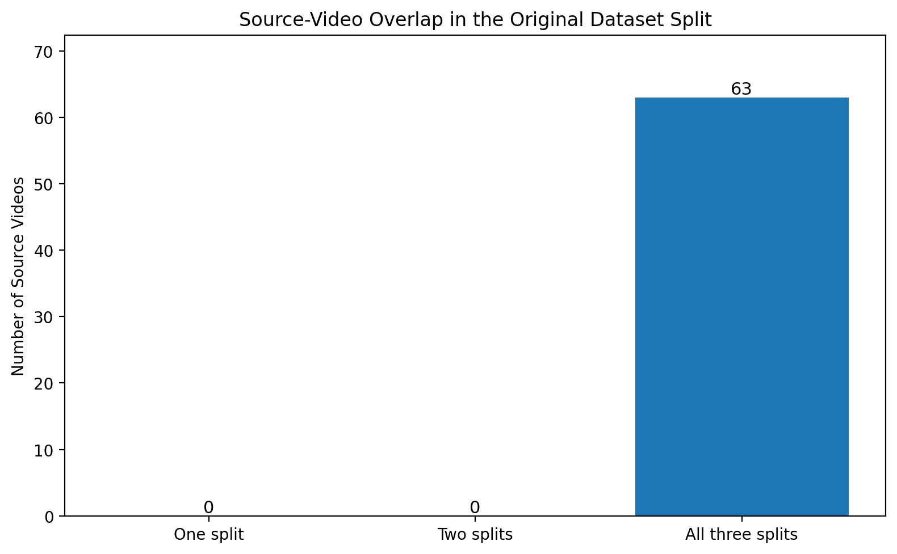
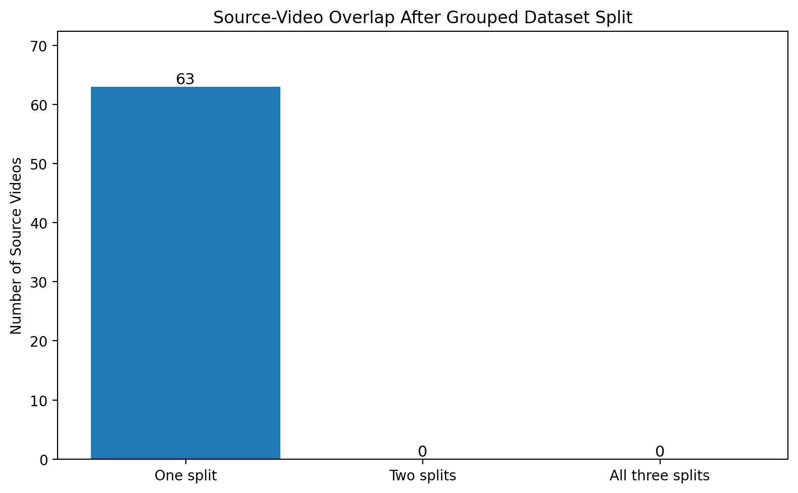
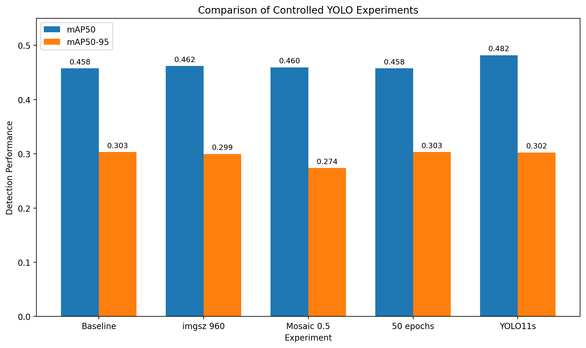

# Maritime Object Detection for Environmental Robotics

This repository contains my work for the Maritime Detection Traineeship at the Laboratory for Autonomous Systems and Mobile Robotics (LAMOR), Faculty of Electrical Engineering and Computing (FER), University of Zagreb.


## Project Goal

The objective of this project is to study and develop real-time maritime object detection and tracking systems using modern computer vision and deep learning techniques.

## Technologies

-Python
-Ultralytics YOLO11
-PyTorch
-OpenCV
-Git


### Project Structure


```
maritime-detection/
├── data/
│   ├── raw/
│   ├── processed/
│   └── datasets/
├── docs/
├── models/
├── notebooks/
├── outputs/
├── runs/
├── scripts/
├── README.md
├── requirements.txt
└── notes.md
```

## Current Progress

### Week 1
- Set up the project environment.
- Created a Python virtual environment.
- Initialized a Git repository.
- Installed Ultralytics YOLO11.
- Ran first detection and tracking experiments.

### Week 2
- Read the maritime small object detection survey.
- Learned why maritime object detection is challenging.
- Studied IoU, mAP, Precision and Recall.

### Week 3
- Downloaded and explored the Singapore Maritime dataset.
- Analyzed YOLO annotations and class distribution.

### Dataset Quality and Leakage Analysis
- Identified source-video leakage across the original train, validation, and test splits.
- Found that all 63 source videos appeared across all three splits.
- Reconstructed the dataset using source-video-level grouping.
- Verified that the grouped dataset contains no source-video overlap between splits.

#
### Source-Video Leakage

The original dataset split contained frames from the same source videos across
training, validation, and test sets.



After grouping frames by source video, each source video was assigned to only
one dataset split.




## Leak-Free Baseline and Experiments
- Trained a YOLO11n baseline on the grouped dataset.
- Best validation results: Precision 0.6943, Recall 0.4592, mAP50 0.4575, mAP50-95 0.3032.
- Tested image size 960, reduced mosaic augmentation, longer training, and YOLO11s.
- Performed initial error analysis on maritime object classes.


### Experiment Comparison

The following figure compares the main controlled experiments performed on the
leak-free dataset split.




## Current Status

The detection pipeline, dataset auditing, grouped splitting, baseline training, controlled experiments, and initial error analysis have been completed.

Multi-object tracking is the next stage of the project.


## Author


Rana Kuşçu

